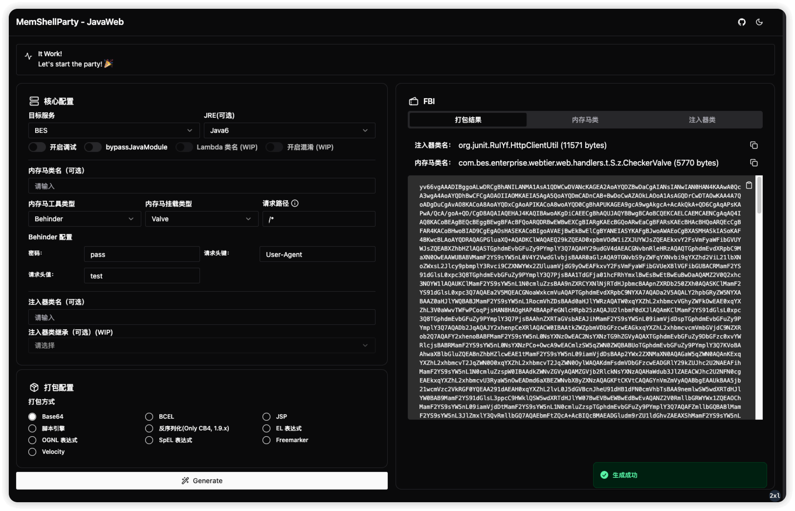

# MemShellParty

[](https://github.com/ReaJason/MemShellParty?tab=MIT-1-ov-file)
[](https://github.com/ReaJason/MemShellParty/actions)
[](https://github.com/ReaJason/MemShellParty/actions)
[](https://github.com/ReaJason/MemShellParty/actions)
[](https://t.me/memshell)

> [!WARNING]
> 本工具仅供安全研究人员、网络管理员及相关技术人员进行授权的安全测试、漏洞评估和安全审计工作使用。使用本工具进行任何未经授权的网络攻击或渗透测试等行为均属违法，使用者需自行承担相应的法律责任。

> [!TIP]
> [GitHub Actions](https://github.com/ReaJason/MemShellParty/actions) 最新一次构建会打印集成测试用例测试结果，可通过此来了解当前支持进度。

> [!WARNING]
> 项目仍在快速迭代过程中（代码结构十分不稳定）......




## 适配情况

### JDK

- [x] Java6 ~ Java8
- [x] Java9
- [x] Java11
- [x] Java17
- [x] Java21

### 内存马功能

- [x] 哥斯拉
- [x] 冰蝎
- [x] 命令执行
- [ ] Suo5
- [ ] Neo-reGeorg
- [ ] Custom

### 封装方式

- [x] JSP
- [x] BCEL
- [x] BASE64
- [x] 脚本引擎
- [x] EL、SpEL、OGNL
- [x] Velocity、Freemarker
- [x] 原生反序列化（CB4）
- [ ] JNDI
- [ ] Agent
- [ ] JDBC 连接
- [ ] 其他常见反序列化

### 中间件以及框架

| Tomcat（5 ~ 11） | Jetty（6 ~ 11） | GlassFish（3 ~ 7） | Payara（5 ~ 6） | Resin（3 ~ 4） | Netty |
|----------------|---------------|------------------|---------------|--------------|-------|
| Servlet        | Servlet       | Filter           | Filter        | Servlet      | x     |
| Filter         | Filter        | Listener         | Listener      | Filter       |       |
| Listener       | Listener      | Valve            | Valve         | Listener     |       |
| Valve          |               |                  |               |              |       |

| JBossAS（4 ~ 7） | JBossEAP（6 ~ 7） | WildFly（9 ~ 30） | Undertow | SpringMVC | SpringWebFlux |
|----------------|-----------------|-----------------|----------|-----------|---------------|
| Filter         | Filter          | Servlet         | Servlet  | x         | x             |
| Listener       | Listener        | Filter          | Filter   |           |               |
|                |                 | Listener        | Listener |           |               |

| WebSphere（7 ~ 9） | WebLogic | 宝兰德 BES | 东方通 TongWeb | 中创 InforSuite AS | 金蝶 Apusic AS |
|------------------|----------|---------|-------------|------------------|--------------|
| Servlet          | x        | x       | x           | x                | x            |
| Filter           |          |         |             |                  |              |
| Listener         |          |         |             |                  |              |

## Usage

使用 docker 部署之后访问 http://127.0.0.1:8080

```
docker run -it -d --name memshell -p 8080:8080 reajason/memshell-party
```

## How

1. 如何使用 bytebuddy 生成类，为属性赋值，添加方法，指定位置调用方法？（**WIP**）
2. 如何调试内存马，为什么内存马注入了却不可用？（**WIP**）

## Contribute

> It will be so nice if you want to contribute. 🎉


参考 [CONTRIBUTE.md](CONTRIBUTING.md)。

## Thanks

- [pen4uin/java-memshell-generator](https://github.com/pen4uin/java-memshell-generator)

### Let's start the party 🎉