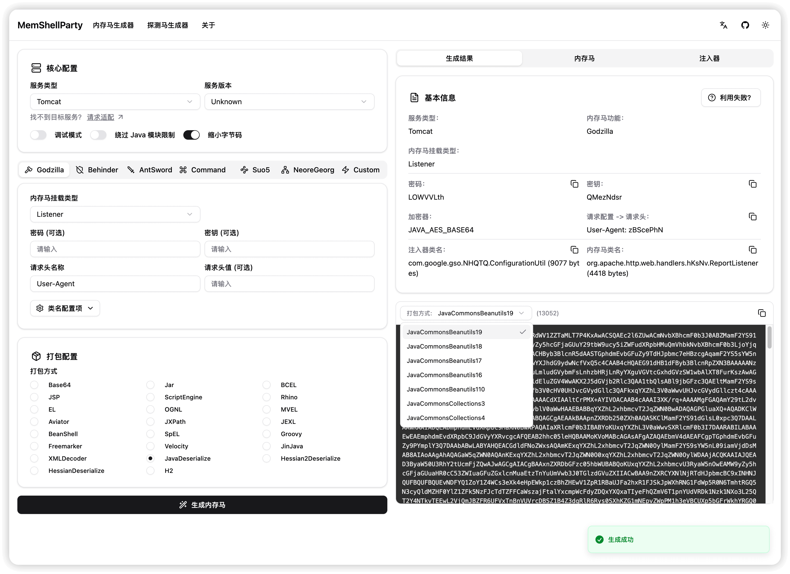
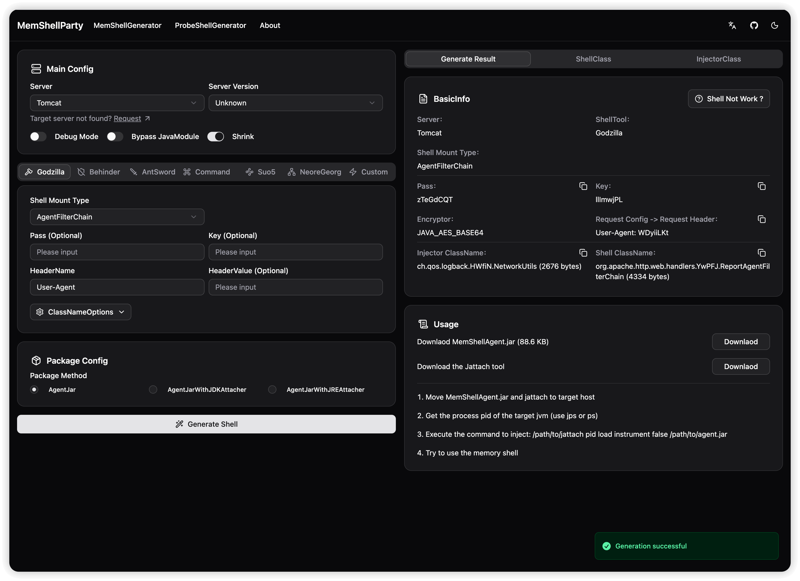
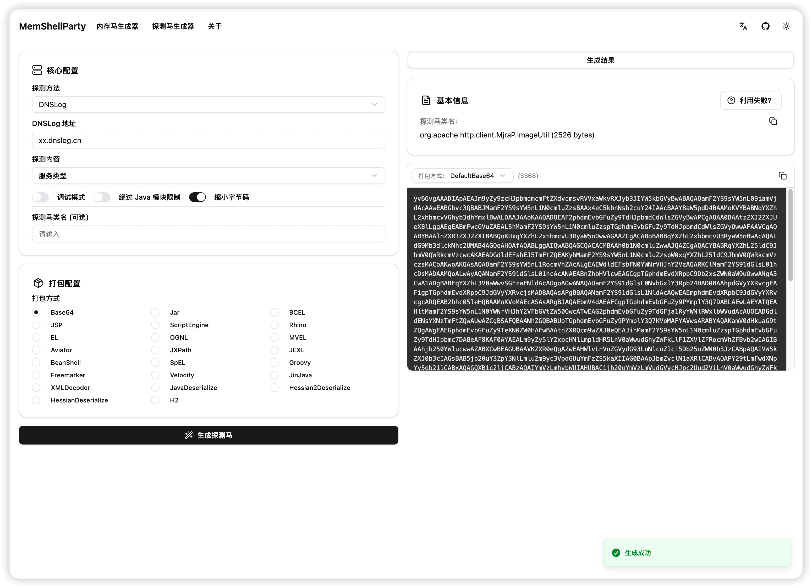
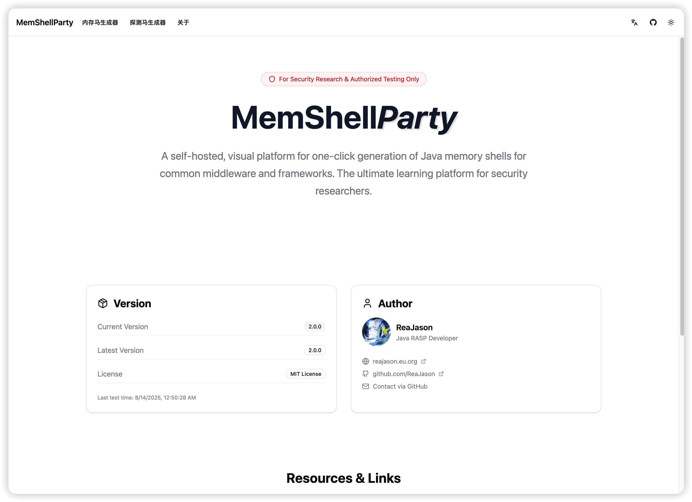

<h1 align="center">MemShellParty</h1>

<p align="center">中文 | <a href="./docs/README.en.md">English</a><br></p>


<div align="center">

[](https://github.com/ReaJason/MemShellParty/releases)
[](https://central.sonatype.com/artifact/io.github.reajason/generator)
[](https://hub.docker.com/r/reajason/memshell-party)
</div>
<div align="center">

[](https://t.me/memshell)
[](https://party.mem.mk)
</div>

> [!WARNING]
> 本工具仅供安全研究人员、网络管理员及相关技术人员进行授权的安全测试、漏洞评估和安全审计工作使用。使用本工具进行任何未经授权的网络攻击或渗透测试等行为均属违法，使用者需自行承担相应的法律责任。

> [!TIP]
> 由于本人仅是安全产品研发，无实战经验，如使用或实现有相关疑问或者适配请求可提 issue 或加入 TG
> 交流群，欢迎一起学习交流。

MemShellParty 是一款专注于主流 Web 中间件的内存马快速生成工具，致力于简化安全研究人员和红队成员的工作流程，提升攻防效率。

<p align="center">
  
  
  
  
</p>

## 主要特性

- **无侵入性**：生成的内存马不会影响目标中间件正常流量，即使同时注入十几个不同的内存马。
- **强兼容性**：覆盖攻防场景下常见中间件和框架，以及 JDK 适配 JDK6 ~ JDK21。
- **高可用性**：对所有支持的中间件框架建立了全面的自动化测试矩阵，确保每一次生成的载荷都具备最高的可用性和稳定性，杜绝实战中的不确定性。
- **极致轻量化**：通过深度优化的字节码生成策略，MemShellParty 将内存马体积相较于 JMG 等传统工具进行了大幅缩小，常规内存马缩小了
  **30%**，Agent 内存马采用 ASM 技术缩小了 **80%**。
- **傻瓜一键化**：内置针对主流表达式注入、反序列化、SSTI 等常见漏洞的载荷生成。系统会自动根据绕过 Java
  模块限制配置，动态生成最优攻击载荷。可实现常规漏洞载荷一键生成。
- **高灵活性**：原生支持哥斯拉、冰蝎、蚁剑、Suo5、NeoreGeorg 等常用内存马功能，通过高度灵活的自定义内存马上传功能，可以将任何定制化载荷融入
  MemShellParty 的生成体系，打造最贴合自身战术需求的攻击平台。

## 快速使用

### 使用前必看

[Java 服务简介.md](./docs/ServerIntro.md)，用于了解 MemShellParty
中针对各个服务适配的情况，针对不同的应用选择合适的服务类型。

探测马中探测服务类型已经做了一一对应，探测出来的服务类型，即是可生成内存马的服务类型（非中间件类型，例如 Apusic10 探测出来的结果为
GlassFish，因为它使用的是 GlassFish 进行的二开）。

### 在线站点

> 仅限尝鲜的小伙伴，对于其他暴露在公网的服务请谨慎使用，小心生成的内存马带后门

可访问（master 分支） [https://party.mem.mk](https://party.mem.mk)。每次 Release 都会自动部署最新的镜像。

对于正在开发的功能可访问（dev 分支）  [https://dev-party.mem.mk](https://dev-party.mem.mk) 抢先体验。

### 本地部署（推荐）

> 适合内网或本地快速部署，直接使用 Docker 启动服务方便快捷

使用 docker 部署之后访问 http://127.0.0.1:8080

```bash
# 使用 Docker Hub 源，拉取最新的镜像
docker run --pull=always --rm -it -d -p 8080:8080 --name memshell-party reajason/memshell-party:latest

# 使用 Github Container Registry 源，拉取最新的镜像
docker run --pull=always --rm -it -d -p 8080:8080 --name memshell-party ghcr.io/reajason/memshell-party:latest

# 网络质量不太好？使用南大 Github Container Registry 镜像源
docker run --pull=always --rm -it -d -p 8080:8080 --name memshell-party ghcr.nju.edu.cn/reajason/memshell-party:latest
```

## Special Thanks

- [vulhub/java-chains](https://github.com/vulhub/java-chains)
- [pen4uin/java-memshell-generator](https://github.com/pen4uin/java-memshell-generator)
- [pen4uin/java-echo-generator](https://github.com/pen4uin/java-echo-generator)

### Let's start the party 🎉
