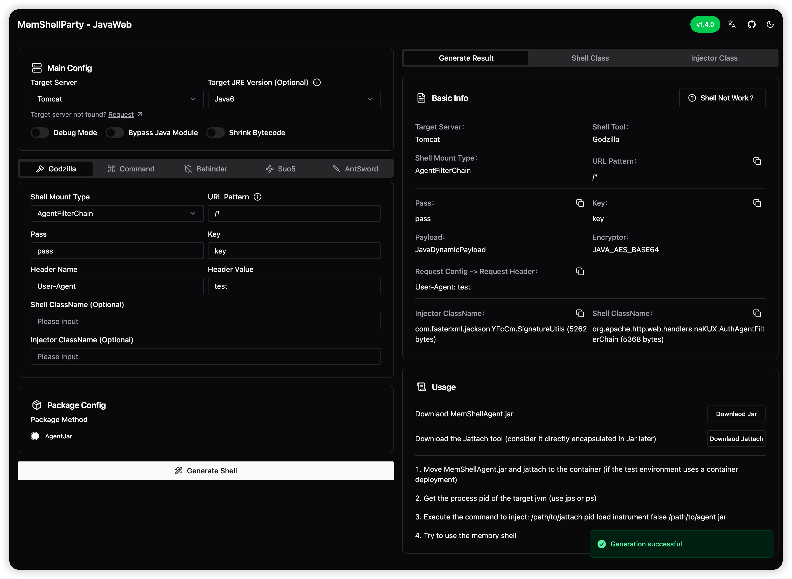

<div align="center">
<h1 align="center">MemShellParty</h1>

<p>一键生成常见中间件框架内存马，让内存马测试变得简单高效，打造内存马的全方位学习平台</p>
<p>在遍地是轮子的时代，是时候造车，带着大伙加速冲冲冲了</p>

[](https://github.com/ReaJason/MemShellParty/actions)
[](https://github.com/ReaJason/MemShellParty/actions)
[](https://github.com/ReaJason/MemShellParty/actions)
[](https://github.com/ReaJason/MemShellParty?tab=MIT-1-ov-file)
[](https://t.me/memshell)

</div>

> [!WARNING]
> 本工具仅供安全研究人员、网络管理员及相关技术人员进行授权的安全测试、漏洞评估和安全审计工作使用。使用本工具进行任何未经授权的网络攻击或渗透测试等行为均属违法，使用者需自行承担相应的法律责任。

> [!TIP]
> 项目仍在快速迭代过程中，如有相关疑问或者适配请求可提 issue 或加入 TG
> 交流群，由于本人仅是安全产品研发，无实战经验，欢迎一起学习交流




## 主要特性

- 自动化测试保障: 自带完备的 [CI 集成测试](https://github.com/ReaJason/MemShellParty/actions/workflows/ci.yaml)
  ，确保常见场景下的高可用性。
- 优化的用例设计: 尽可能精简内存马大小，高效传输。
- 广泛的兼容性: 覆盖攻防场景下常见中间件和框架。

## 快速启动

### 在线站点

可直接访问 https://party.memshell.news （没做加速，搭建在 [Northflank](https://northflank.com/) US
节点上，访问较慢，Thanks [@xcxmiku](https://github.com/xcxmiku)）

### 本地部署（推荐）

使用 docker 部署之后访问 http://127.0.0.1:8080

```bash
docker run --pull=always --rm -it -d -p 8080:8080 --name memshell reajason/memshell-party
```

## 适配情况

已兼容 Java6 ~ Java8、Java9、Java11、Java17、Java21

### 中间件以及框架

| Tomcat（5 ~ 11）       | Jetty（6 ~ 11）          | GlassFish（3 ~ 7）     | Payara（5 ~ 6）        |
|----------------------|------------------------|----------------------|----------------------|
| Servlet              | Servlet                | Filter               | Filter               |
| Filter               | Filter                 | Listener             | Listener             |
| Listener             | Listener               | Valve                | Valve                |
| Valve                | ServletHandler - Agent | FilterChain - Agent  | FilterChain - Agent  |
| FilterChain - Agent  |                        | ContextValve - Agent | ContextValve - Agent |
| ContextValve - Agent |                        |                      |                      |

| Resin（3 ~ 4）        | SpringMVC                | SpringWebFlux   | XXL-JOB      |
|---------------------|--------------------------|-----------------|--------------|
| Servlet             | Interceptor              | WebFilter       | NettyHandler |
| Filter              | ControllerHandler        | HandlerMethod   |              |
| Listener            | FrameworkServlet - Agent | HandlerFunction |              |
| FilterChain - Agent |                          | NettyHandler    |              |

| JBossAS（4 ~ 7）       | JBossEAP（6 ~ 7）            | WildFly（9 ~ 30）        | Undertow               |
|----------------------|----------------------------|------------------------|------------------------|
| Filter               | Filter                     | Servlet                | Servlet                |
| Listener             | Listener                   | Filter                 | Filter                 |
| Valve                | Valve(6)                   | Listener               | Listener               |
| FilterChain - Agent  | FilterChain - Agent (6)    | ServletHandler - Agent | ServletHandler - Agent |
| ContextValve - Agent | ContextValve - Agent (6)   |                        |                        |
|                      | ServletHandler - Agent (7) |                        |                        |

| WebSphere（7 ~ 9）      | WebLogic （10.3.6  ~ 14） |
|-----------------------|-------------------------|
| Servlet               | Servlet                 |
| Filter                | Filter                  |
| Listener              | Listener                |
| FilterManager - Agent | ServletContext - Agent  |

| BES（9.5.x）           | TongWeb（6 ~ 7）       | InforSuite AS （9 ~ 10） | Apusic AS （9） |
|----------------------|----------------------|------------------------|---------------|
| Filter               | Filter               | Filter                 | Servlet       |
| Listener             | Listener             | Listener               | Filter        |
| Valve                | Valve                | Valve                  | Listener      |
| FilterChain - Agent  | FilterChain - Agent  | FilterChain - Agent    |               |
| ContextValve - Agent | ContextValve - Agent | ContextValve - Agent   |               |

### 内存马功能

- [x] 哥斯拉
- [x] 冰蝎
- [x] 命令执行
- [ ] Suo5
- [ ] Neo-reGeorg
- [ ] Custom

### 封装方式

- [x] JSP
- [x] BCEL
- [x] BASE64
- [x] 脚本引擎
- [x] EL、SpEL、OGNL
- [x] Velocity、Freemarker
- [x] 原生反序列化（CB4）
- [ ] JNDI
- [ ] Agent
- [ ] JDBC 连接
- [ ] 其他常见反序列化

## How

1. 如何使用 bytebuddy 生成类，为属性赋值，添加方法，指定位置调用方法？（**WIP**）
2. 如何调试内存马，为什么内存马注入了却不可用？（**WIP**）

## Contribute

> It will be so nice if you want to contribute. 🎉


参考 [CONTRIBUTE.md](CONTRIBUTING.md)。

## Thanks

- [pen4uin/java-memshell-generator](https://github.com/pen4uin/java-memshell-generator)

### Let's start the party 🎉