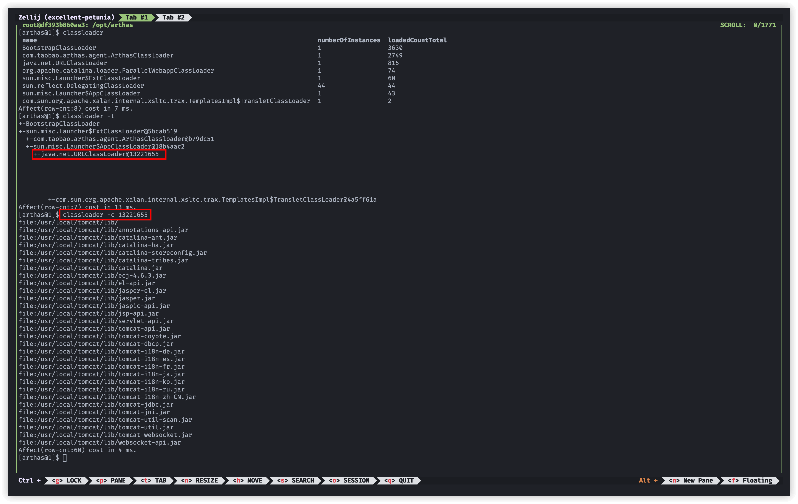
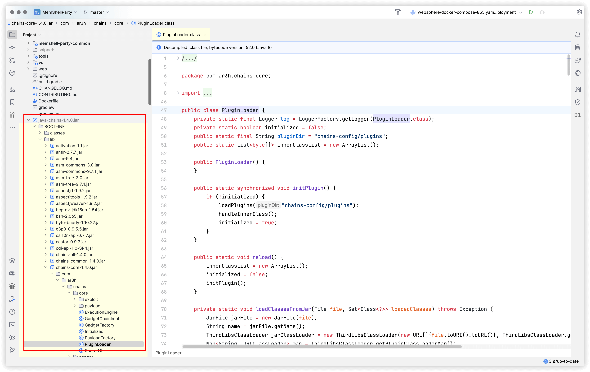

# 学习 Java 内存马推荐工具

> 工欲善其事必先利其器

## Arthas

Arthas 是阿里云开源的 Java 诊断工具，其本质是一个 Java Agent，它提供了各种各样的命令，能让我们洞察 JVM 各种细节信息。所有的使用姿势 [官方文档](https://arthas.aliyun.com/) 都有，以下会列举一些常见的场景和问题

JDK8 以上的下载链接，https://arthas.aliyun.com/doc/download.html
JDK6/7 下载链接，https://arthas.aliyun.com/3.x/doc/download.html

### 启动 Arthas

直接输入 `java -jar arthas-boot.jar` 启动，回车之后会弹出选项，输入数字选择需要调试的 Java 进程。

```bash
❯ java -jar arthas-boot.jar
[INFO] JAVA_HOME: /Users/reajason/.sdkman/candidates/java/21.0.5-oracle
[INFO] arthas-boot version: 4.0.5
[INFO] Found existing java process, please choose one and input the serial number of the process, eg : 1. Then hit ENTER.
* [1]: 83922 /Users/reajason/.vscode/extensions/sonarsource.sonarlint-vscode-4.19.0-darwin-arm64/server/sonarlint-ls.jar
  [2]: 86557 com.intellij.idea.Main
```

有时候可能没有 jps 命令或者不是 HotSpot JVM 会找不到 Java 进程，此时你需要通过 `ps` 找到你需要调试的 Java 进程 PID，并使用 `java -jar arthas-boot.jar <pid>` 启动。

```bash
root@df393b860ae3:/opt/arthas# java -jar arthas-boot.jar
[INFO] JAVA_HOME: /opt/java/openjdk
[INFO] arthas-boot version: 4.0.5
[INFO] Can not find java process. Try to run `jps` command lists the instrumented Java HotSpot VMs on the target system.
Please select an available pid.
```

arthas-boot 依赖 JDK 环境需要 tools.jar 才能启动，在 JRE 环境会歇菜。

```bash
root@df393b860ae3:/opt/arthas# ps -ef | grep java
root           1       0  3 14:19 ?        00:00:01 /opt/java/openjdk/bin/java -Djava.util.logging.config.file=/usr/local/tomcat/conf/logging.properties -Djava.util.logging.manager=org.apache.juli.ClassLoaderLogManager -agentlib:jdwp=transport=dt_socket,server=y,suspend=n,address=5005 -Djdk.tls.ephemeralDHKeySize=2048 -Djava.protocol.handler.pkgs=org.apache.catalina.webresources -Dorg.apache.catalina.security.SecurityListener.UMASK=0027 -Dignore.endorsed.dirs= -classpath /usr/local/tomcat/bin/bootstrap.jar:/usr/local/tomcat/bin/tomcat-juli.jar -Dcatalina.base=/usr/local/tomcat -Dcatalina.home=/usr/local/tomcat -Djava.io.tmpdir=/usr/local/tomcat/temp org.apache.catalina.startup.Bootstrap start
root          87      50  0 14:20 pts/0    00:00:00 grep --color=auto java
root@df393b860ae3:/opt/arthas# java -jar arthas-boot.jar 1
[INFO] JAVA_HOME: /opt/java/openjdk
[INFO] arthas-boot version: 4.0.5
[INFO] arthas home: /opt/arthas
[INFO] Try to attach process 1
Exception in thread "main" java.lang.IllegalArgumentException: Can not find tools.jar under java home: /opt/java/openjdk, please try to start arthas-boot with full path java. Such as /opt/jdk/bin/java -jar arthas-boot.jar
        at com.taobao.arthas.boot.ProcessUtils.findJavaHome(ProcessUtils.java:222)
        at com.taobao.arthas.boot.ProcessUtils.startArthasCore(ProcessUtils.java:233)
        at com.taobao.arthas.boot.Bootstrap.main(Bootstrap.java:590)
```

前面说了 Arthas 本质就是 Java Agent，因此使用 [jattach](https://github.com/jattach/jattach/releases/latest) 工具将其注入，再尝试连接即可。

TIP1: **注入的是 `/opt/arthas/arthas-agent.jar`**
TIP2: **启动仍然用的 `arthas-boot.jar`**

```bash
root@df393b860ae3:/opt/arthas# ./jattach-linux 1 load instrument false /opt/arthas/arthas-agent.jar
Connected to remote JVM
JVM response code = 0
0

root@df393b860ae3:/opt/arthas# java -jar arthas-boot.jar 1
[INFO] JAVA_HOME: /opt/java/openjdk
[INFO] arthas-boot version: 4.0.5
[INFO] arthas home: /opt/arthas
[INFO] The target process already listen port 3658, skip attach.
[INFO] arthas-client connect 127.0.0.1 3658
  ,---.  ,------. ,--------.,--.  ,--.  ,---.   ,---.
 /  O  \ |  .--. ''--.  .--'|  '--'  | /  O  \ '   .-'
|  .-.  ||  '--'.'   |  |   |  .--.  ||  .-.  |`.  `-.
|  | |  ||  |\  \    |  |   |  |  |  ||  | |  |.-'    |
`--' `--'`--' '--'   `--'   `--'  `--'`--' `--'`-----'

wiki        https://arthas.aliyun.com/doc
tutorials   https://arthas.aliyun.com/doc/arthas-tutorials.html
version     4.0.5
main_class  org.apache.catalina.startup.Bootstrap start
pid         1
start_time  2025-04-09 14:19:48.004
currnt_time 2025-04-09 14:23:16.044

[arthas@1]$
```

当看到大片上述输出，且命令提示符变成 `[arthas@1]$` 你就成功进入 Arthas 了，接下来让我们看看有哪些好用的命令吧。

### jad

> [官方文档/jad.html](https://arthas.aliyun.com/doc/jad.html)

jad 命令是用来查看反编译后的类源码。除了源码信息，还能查看是哪一个 classloader 加载的当前类，以及 classloader 的继承关系，还能看到当前类存在在哪个 jar 文件中（如果有的话），拖到 IDEA 里面就能进行调试啦。

- `jad org.apache.lESNa.EncryptionUtil`，查看类源码完整信息。
- `jad org.apache.catalina.core.ApplicationFilterChain doFilter`，仅查看 doFilter 方法的源码。


如果回车之后显示找不到类的话，可能拼写错误，或类还没有被加载到 JVM 中，可以先尝试访问类依赖的业务路径，触发类加载之后再进行 jad。

### classloader

> [官方文档/classloader.html](https://arthas.aliyun.com/doc/classloader.html)

classloader 用来查看类加载器信息。

- `classloader` 查看当前有哪些类加载器，以及其类加载情况
- `classloader -t` 查看类加载器继承关系
- `classloader -c <hash>` 指定类加载实例 hash 查看其 urls



此处的分析将会在 Java 基础中提及，有些 ClassNotFoundException 或 ClassCastException 可以通过此种方式找到问题所在。

### sc

> [官方文档/sc.html](https://arthas.aliyun.com/doc/sc.html)

sc 即 search-class，用来查找 JVM 中的类信息。常用的一种方式是查看 interface 的所有实现类。

- `sc javax.servlet.Servlet`，查看 Servlet 实现类有哪些
- `sc javax.servlet.ServletContext`，查看 ServletContext 实现类有哪些
- `sc -d org.apache.catalina.core.ApplicationContext`，查看类的详细信息，这样我们能定位到 jar 拖出来进行反编译分析。


### stop

执行 stop 退出当前 Arthas 命令行环境，回到 Unix shell。

```
[arthas@1]$ stop
Resetting all enhanced classes ...
Affect(class count: 0 , method count: 0) cost in 2 ms, listenerId: 0
Arthas Server is going to shutdown...
[arthas@1]$ session (c5ee97b5-6809-48ab-bdfc-09d900087ec9) is closed because server is going to shutdown.
```

## Jadx

> [skylot/jadx](https://github.com/skylot/jadx)

目前 Java 最强反编译器，人手一个，几乎可以反编译任何 jar 包，部分究极混淆的类，即使无法反编译成功，也可查看字节码。

打开之后，可以直接将 class 或 jar 拖入到左边框中就会自动进行反编译，点击 Source Code 里面就能看到反编译的结果，最下面可以选 Code、Smali 等等，一般 Code 里面反编译失败才需要切换，其他功能可查看 [记录 Rainbow Brackets 插件破解](https://reajason.eu.org/writing/rainbowbracketscracked/) 了解一下常用的操作。


## File Expander — IDEA 插件

IDEA 自带反编译功能，并且使用习惯之后也是相当好用。但是有一个问题，如果 jar 包中套 jar 包，那么里面的 jar 包并不会默认展开，自然想到的办法就是解压 一次 jar，把里面的东西弄出来，但是有了 File Expander 插件之后，无论是 zip 还是 jar in jar，都轻松查看了。


下图演示了 java-chains-1.4.0.jar，直接可以 expand 到 chains-core，开学！！！，这种情况下不比 jadx 要好用。



## Find 命令

在批量查找当前目录下某个类存在于那个 jar 文件中，需要使用到 find 命令协助，由于需要用到 jar 命令，因此依赖 JDK 环境。JRE 环境下，可以将文件打包发送到 JDK 环境再继续研究。

在 tomcat 目录下，找到 ApplicationContext 在哪个 jar 文件中。

```bash
░▒▓ ~/workspace/apache-tomcat-8.5.96
❯ find . -name "*.jar" -type f -exec sh -c 'jar tvf "{}" | grep -q "org/apache/catalina/core/ApplicationContext" && echo "Found in: {}"' \;
Found in: ./lib/catalina.jar
```

部分环境下，例如 WAS 可能并没有设置 Java Home，此时 jar 命令使用绝对路径即可。

```bash
[was@59385194e5aa AppServer]$ find . -name "*.jar" -type f -exec sh -c '/opt/IBM/WebSphere/AppServer/java/bin/jar tvf "{}" | grep -q "com/ibm/ws/webcontainer/webapp/WebApp" && echo "Found in: {}"' \;
Found in: ./plugins/com.ibm.ws.webcontainer.jar
```
