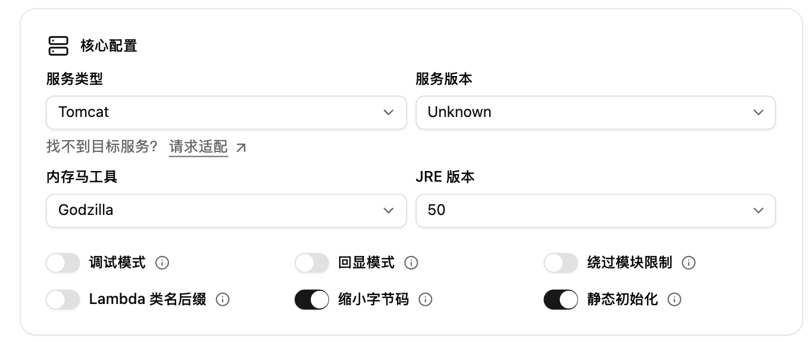
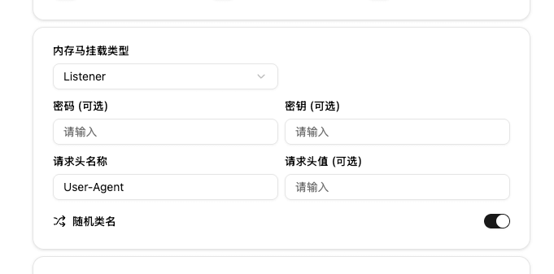
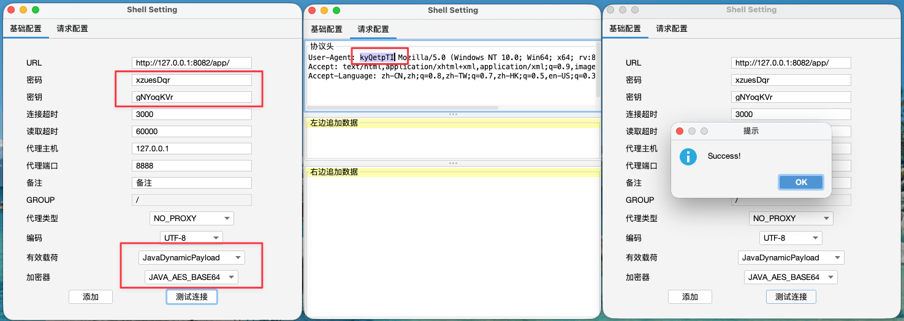
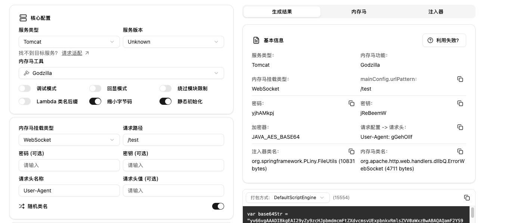
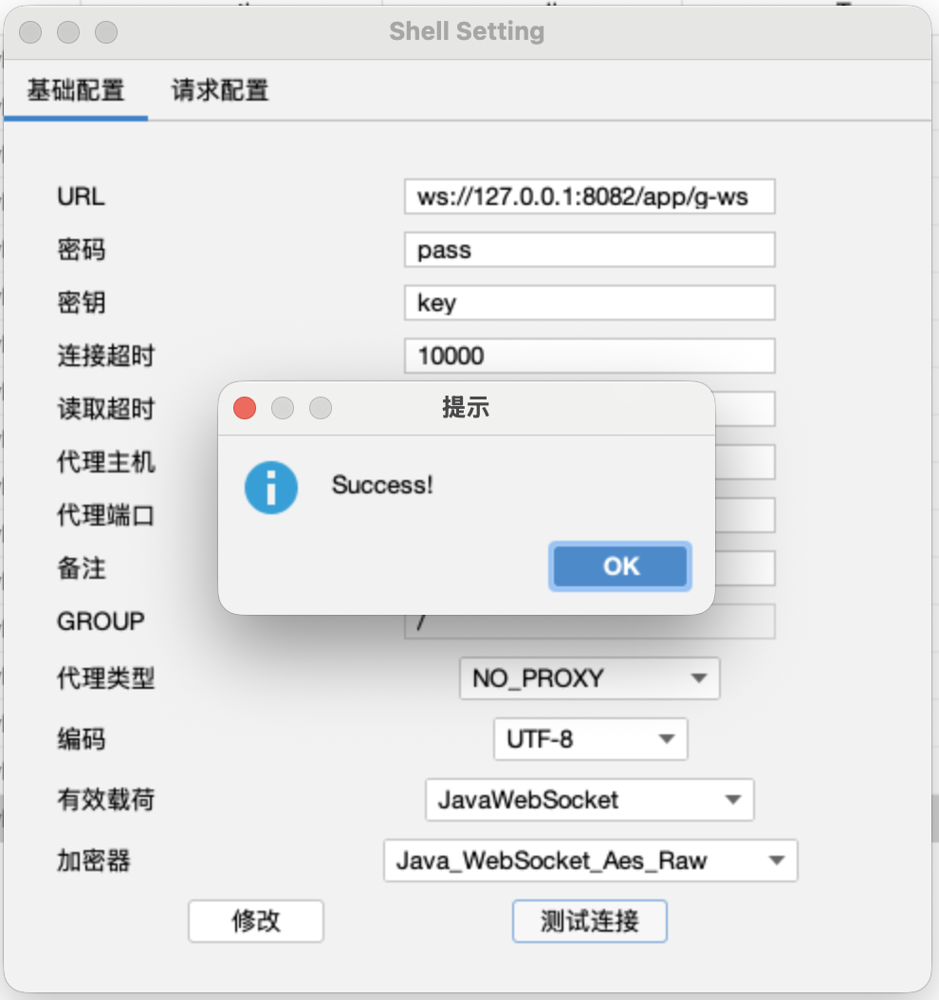
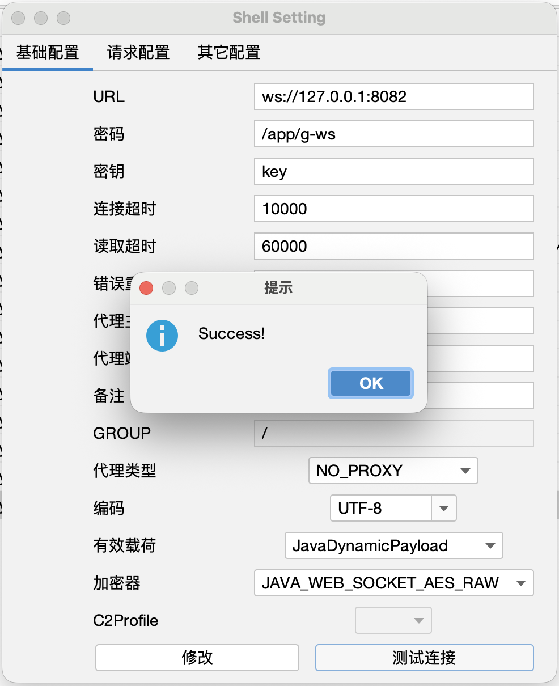

import { Step, Steps } from 'fumadocs-ui/components/steps';

<Callout type="info">项目地址：https://github.com/BeichenDream/Godzilla</Callout>

> 真正优秀的武器化平台，应当具备高度模块化与可插拔式体系结构，使所有核心组件均能够实现热插拔级的动态加载与替换；平台内核无需进行任何魔改或二次开发，即可通过标准化的扩展接口装载任意核心模块，从而在保证稳定性的前提下实现演进式扩展与能力快速迭代。以 CVE-2025-55182 为例，Godzilla 的核心能力均以插件形式实现完全解耦，涵盖有效载荷、加密器、功能插件以及流量传输信道等所有关键组件，并且均支持在运行态进行热加载与无缝替换。基于这一架构特性，我在仅用一天时间完成了 CVE-2025-55182 的利用链开发，并为 Godzilla 扩展了对 Node.js 语言的全量支持（覆盖所有核心能力模块），从工程实践层面验证了 Godzilla 框架在模块化设计、扩展性和快速适配能力方面的卓越架构优势。 —— [@BeichenDream](https://github.com/BeichenDream)

## 使用步骤

<Steps>
<Step>
### 选择 Godzilla 内存马工具

由于 Godzilla 的超强兼容性，使得其能修改服务端代码适配各种各样的环境，因此 Godzilla 是默认首选的内存马工具。

</Step>

<Step>
### 设置密码与密钥以及流量入口特征

1. 密码与密钥是 Godzilla 连接客户端所需要的两个参数，用于通信加密和流量随机特征 key，默认不填会随机生成。
2. 为了防止正常业务进入 Godzilla 内存马影响到正常业务，需要指定流量特征进入 Godzilla 内存马逻辑处理，此处使用特定请求头和请求值来标识，默认情况下是 User-Agent，请求值会随机生成

</Step>

<Step>
### 生成并注入

选取合适的打包方式，并进行内存马的注入。

</Step>
<Step>
### 使用客户端尝试连接

1. 填写密码和密钥，并选择 JavaDynamicPayload 中的 JAVA_AES_BASE64 加密器。
2. 在请求配置处配置流量入口特征生成的特征值
3. 点击测试连接尝试连接，连接成功即可点击添加到 shell 管理界面

</Step>
</Steps>

## Godzilla WebSocket 马支持

<Steps>

<Step>
### 生成 WebSocket 马
目前仅支持 Tomcat，当选中 Tomcat Godzilla，可以在内存马挂载类型处选择 WebSocket 内存马

</Step>

<Step>
### 下载并装载插件

下载链接：https://github.com/xsshim/GzWebsocket/blob/main/plugins/GzWebsocket.jar?raw=true

在哥斯拉主界面，菜单栏找到配置 -> 插件配置，添加加上下载下来的 GzWebSocket.jar，插件兼容性较差，仅支持 JDK8 启动 Godzilla 才可使用。

</Step>

<Step>

### 使用客户端尝试连接

1. URL 需要注意使用 `ws://` 协议头，由于 ws 没有请求头那些东西，因此请求配置不需要额外配置请求头
2. 有效载荷在装载完上续 GzWebSocket.jar 插件后，会出现 JavaWebSocket 选择 Java_WebSocket_Aes_Raw 加密器即可尝试连接。

如果你是用是哥斯拉特战版，需要注意请求地址不要写 path 只写 ip:host，密码处填 path 即 `/app/g-ws`

</Step>

</Steps>