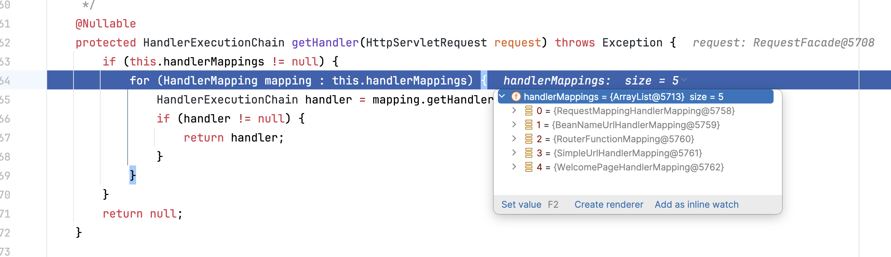
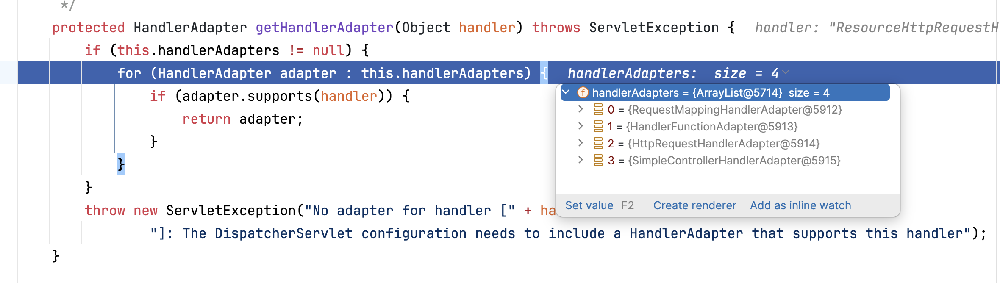

## HandlerMapping

[前面](/docs/springweb#spring-webmvc) 我们有说 WebMVC Controller 控制器实际上就是 Handler，并且由 HandlerMapping 管理着。我们在 getHandler 打断点看一下我们常用的 Spring Boot2 中所拥有的 HandlerMapping 有哪些。

1. **org.springframework.web.servlet.mvc.method.annotation.RequestMappingHandlerMapping**：为使用 @Controller 和 @RequestMapping 类和方法创建 HandlerMethod。
2. **org.springframework.web.servlet.handler.BeanNameUrlHandlerMapping**：将 beanName 以 `/` 开头的 bean 注册为 Handler。
3. **org.springframework.web.servlet.function.support.RouterFunctionMapping**：收集 RouterFunction bean 组合成为 Handler。
4. **org.springframework.web.servlet.handler.SimpleUrlHandlerMapping**：传入 url 与 handler 映射的 map 组成 HandlerMapping。
5. **org.springframework.boot.autoconfigure.web.servlet.WelcomePageHandlerMapping**：访问 / 转发到 index.html，因此 /index.html 为欢迎页面。

优先级从高往低，从前往后只要获取到能处理当前 request 的 Handler 即返回，所以如果在后面的 HandlerMapping 定义需要确保不能与前面 HandlerMapping 重复。

HandlerMapping 里面决定了我们 Handler 应该如何注册进去的核心逻辑，但是 Handler 该如何编写，由 HandlerAdapter 说了算。

## HandlerAdapter

同样以最常见的 Spring Boot2 为例，在 getHandlerAdapter 打断点，看一下当前支持哪些 HandlerAdapter。

1. **org.springframework.web.servlet.mvc.method.annotation.RequestMappingHandlerAdapter**：需要 handler 为 org.springframework.web.method.HandlerMethod 实例。
2. **org.springframework.web.servlet.function.support.HandlerFunctionAdapter**：需要 handler 继承 org.springframework.web.servlet.function.HandlerFunction。
3. **org.springframework.web.servlet.mvc.HttpRequestHandlerAdapter**：需要 handler 继承 org.springframework.web.HttpRequestHandler。
4. **org.springframework.web.servlet.mvc.SimpleControllerHandlerAdapter**：需要 handler 继承 org.springframework.web.servlet.mvc.Controller。

